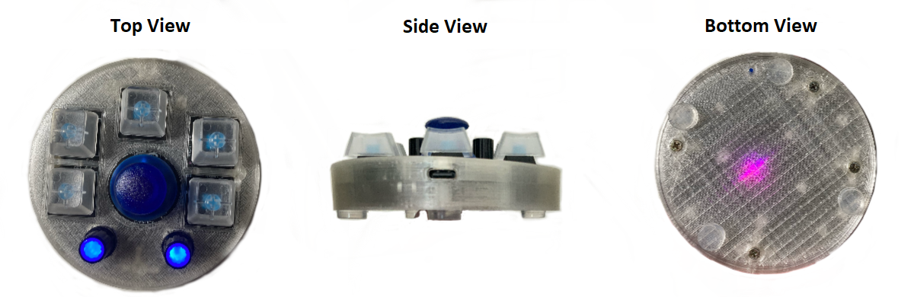

<h1> Macro-Keyboard-with-Encoders</h1>
 

 
<h3> Introduction and background </h3>
 
 
The idea to make this macro keyboard came to me when I was learning CAD and I found myself needing to use multiple keys shortcuts that included also middle mouse button presses for orbiting around the 3D object.
That was the moment when I went out to search for an accessory that can ease my life but to my surprise what was available on the market was also quite expensive to the point that I felt it was not worth it as I am not a CAD/CAM designer by trade but I wanted to learn a skill to aid my maker skill set. So what's the next thing a maker will do ? Indeed a maker will make it's own spin of an accessory.  
When making this keyboard I wanted to build something that fulfilled a few requirements :
<ul>
  <li> Easy to use for any user with out without technical knowledge</li>
  <li> Easy to set and use on any common Operating System ( Windows/MacOS/Linux ... ) </li>
  <li> No special software required to change the key's functionality</li>
  <li> Multiple key presses combined with mouse key presses on a single key </li>
  <li> Multiple ways of controlling the mouse pointer</li>
  <li> Open source as much as possible at least on the software side </li>
  <li> Hackable for the user that wants to do that without any special tools at least for the software side</li>
  <li> 3D printable case for the users that want to customize it</li>
  <li> Open source STL file of the board so the users can build their own spin of the case </li>
</ul>

<h3> What does this keyboard offer ?</h3>

<h4> Hardware </h4>
<ul>
  <li> 5 x MX Key Blue switches ( soldered to the PCB)</li>
  <li> 2 x Rotary encoders with 24 positions per rotation, push button function(click) if it is pressed and a blue led illumination. Left is for horizontal mouse pointer movement and Right is vertical mouse pointer movement</li>
  <li> 1 x Analog Joystick with push button function </li>
  <li> Type-C USB port that works correctly with type-C to type-C cables or type-C to USB-A cables </li>
  <li> Reset button on the bottom to allow quick software upgrade with drag and drop files</li>
  <li> Lightweight Design</li>
</ul>
 
<h4> Software </h4>
 <ul>
  <li> Based on open source bootloader and libraries </li>
  <li> Easy configuration by editing a text file for each individual button</li>
  <li> It can act as a <b>shortcut keyboard</b> => no matter how long you press the button it only clicks once </li>
  <li> It can act as a <b>keyboard</b> => as long as you keep a button pressed the programmed buttons in the configuration file will be pressed; example : in Fusion360 oribiting around a 3D object is done by holding pressed SHIFT+Mouse Middle Button and moving the mouse pointer; this can be achieved by keeping pressed one button on the macro keyboard and moving: your own mouse, the joystick on the macro keyboard or the rotary encoders  </li>
  <li> 2 firmware versions, one for <b>Shortcut keyboard</b> functionality and one for <b>Keyboard</b> functionality .</li>
  <li> In both firmware versions the keyboard can also type text for you i.e.: in case you want to use to type frequently used phrase or passowrd <b>(It's NOT SAFE to save your password in a shortcut keyboard and use it like this but sometimes convenience wins and the option is here but it's your choice if you want to use it or not)</li>
  <li> Access to the source code that was written for the Arduino IDE but it can be used in other IDE's</li>
  <li> .uf2 firmware releases with the original firmware released by me but also future updates in case there will be bugs that need to be fixed.</li>
  
  
<h4> Credits for the software side </h3>
  <ul>
  <li> <a href="https://github.com/adafruit">Adafruit Industries</a> - for their amazing work and tools that they provide for anyone to learn and enchance their skills</li>
  <li> <a href="https://github.com/danionescu0/arduino">Danionescu0</a> - for the helpful work done on parsing text files from an external storage in very short time </li>
  <li> Creators and contribuitors of the <a href="https://github.com/thomasfredericks/Bounce2">Bounce 2 library</a></li>
  <li> Creators and contribuitors of the <a href="https://github.com/mprograms/SimpleRotary">Simple Rotary library</a></li>
  <li> The creator of <a href="https://github.com/blurfl/makeUF2-tool/releases">MakeUF2-tool</a> </li>
 </ul>
