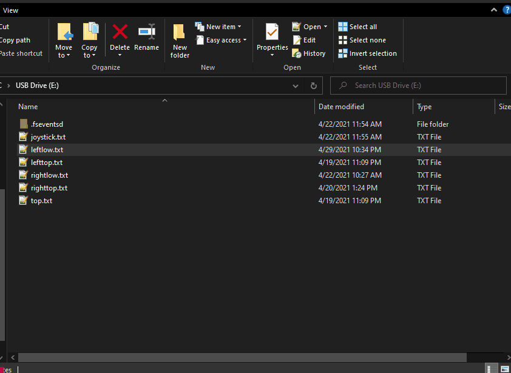

## Thank you for supporting our project and deciding to grab our very first macro keyboard !


```markdown
External Features / Components :

The macro keyboard has the following interfaces : 

    5 x MX-Key Blue switches

    1 x Analog Joystick (with switch functionality , it acts as a button when you press it )

    2 x Rotary Encoders (with switch functionality , it acts as a button when you press it )

    1 x Reset Button 

    1 x Type-C USB connector ( receptacle )

Supported Operating Systems : 

    Any operating system that supports a keyboard and be used with our keyboard
```
### Above Image


### Encoders 


```markdown
The Left Rotary Encoder moves the mouse pointer `Horizontally`. 
The Right Rotary Encoder moves the mouse pointer `Vertically`. 
```

### How to change the buttons configuration/functionality :

In order to use our macro keyboard you have to configure each button to do what you want it to do. This is actually very simple and it is a process you only have to do once . In case anything goes wrong, you can always restore the original files and start again.

### Configuration Steps : 

1. press the configuration button ( top middle button) and while you are keeping the button pressed, insert the usb cable that is connected to your pc.  
  


2. once the cable is connected to your pc the configuration button can be released and in a few seconds a new drive will appear in your file manager or “Computer” ( just like a new USB stick appears when you connect it to your computer).See the image below as an example :  
  
 *If this is the first time you are connecting the keyboard to your computer, it might take a short while to install drivers .* </br>
 3.By opening and accessing the new disk that just appeared you will see a list of 6 ( six) text files that are named corresponding to the key position that each one of them controls. Please see the image below :  
    
 
   
 
 4. In order to change the configuration, you will have to open the file and edit the function(s) that the button will perform . Let’s open the file by double clicking on the button name.  
   
 
    
 The first row starts with *Command::* and after that we have each key separated by comma ``` , ``` please put a comma ``` , ``` after each command and take note that the commands are executed in order.  We will explain the commands possible separately in the Keyboard Commands chapter. You can easily set 3 keys to be pressed at once but more than that is also possible.  

The commands can also be combined with letters ; for example : ``` Command:: KEY_LEFT_CTRL,p, ``` will bring up the print menu in Windows and Linux while ```Command:: KEY_LEFT_ALT,p,``` will open the print menu on MacOs.  

The example below does the following : Simulate SHIFT key press and while SHIFT is pressed it will simulate the press of the Mouse Middle key , this is what is needed for Autodesk Fusion 360 to allow orbiting around a 3D file.   

The second row starts with *Sleep::* and this allows you to set a very short break that is counted in milliseconds in case your computer doesn’t register all the key presses that you have set. The Sleep function just allows a short amount of time for the computer to register each button press and it should be used like this :  

```markdown
Command::KEY_LEFT_SHIFT,
Sleep::5
Command::MOUSE_MIDDLE,
```
#### Don’t use the *Sleep::* function unless you need it !

 
 
### Other examples :
 
Copy Functionality on Windows : 

```markdown
Command::KEY_LEFT_CTRL,
c
```

Paste Functionality for Windows : 
```markdown
Command::KEY_LEFT_CTRL,
v
```

6 - Save the file and you can edit another file or allow 30 seconds, then you can disconnect and reconnect the USB cable. Now you are ready to use your macro keyboard.  </br>

### Restore the original files : 

### Situation A - the configuration files can’t be edited/opened

If your configuration files get damaged you just need to repeat the configuration steps 1 to 3 and then copy the original configuration files that you can download from <a href="https://github.com/mikepdiy/Macro-Keyboard-with-Encoders/tree/main/Config%20Files">here</a>.

### Situation B - My keyboard doesn’t come up as a USB disk anymore

The easiest way to solve this problem is by reflashing the firmware ; to do this please connect the USB cable to your pc and then double press the reset button. Once the button was pressed 2 times, the LED on the bottom on the keyboard will turn **GREEN** and the keyboard will appear as a USB disk with the name : **MAKERKB** . Now you can copy the firmware file that you can download from <a href="https://github.com/mikepdiy/Macro-Keyboard-with-Encoders/tree/main/Code%20V0.1/Bootloader">here</a> to the keyboard (just drag and drop) and it will reflash itself and update.  


#### NOTICE: Please don’t disconnect the keyboard from your PC until the flashing process is done, this can take up to 2 minutes (120 seconds) . 

### KEYBOARD COMMANDS : 

<table>
  <tr>
    <th>Command::</th>
    <th>Function</th>
  </tr>
  <tr>
    <td>KEY_LEFT_CTRL</td>
    <td>CTRL</td>
  </tr>
    <tr>
    <td>KEY_LEFT_GUI</td>
    <td>Windows Key / OPT / Super</td>
  </tr>
    <tr>
    <td>KEY_LEFT_ALT</td>
    <td>Left Alt</td>
  </tr>
    <tr>
    <td>KEY_UP_ARROW</td>
    <td>Arrow Up</td>
  </tr>
      <tr>
    <td>KEY_DOWN_ARROW</td>
    <td>Arrow Down</td>
  </tr>
      <tr>
    <td>KEY_LEFT_ARROW</td>
    <td>Arrow Left</td>
  </tr>
      <tr>
    <td>KEY_RIGHT_ARROW</td>
    <td>Right Up</td>
  </tr>
      <tr>
    <td>KEY_RIGHT_GUI</td>
    <td>Right GUI ( not commonly needed)</td>
  </tr>
        <tr>
    <td>KEY_BACKSPACE</td>
    <td>Backspace</td>
  </tr>
          <tr>
    <td>KEY_TAB</td>
    <td>Tab</td>
  </tr>
          <tr>
    <td>KEY_RETURN</td>
    <td>Retrun / Enter</td>
  </tr>
          <tr>
    <td>KEY_ESC</td>
    <td>Esc</td>
  </tr>
          <tr>
    <td>KEY_INSERT</td>
    <td>Insert</td>
  </tr>
          <tr>
    <td>KEY_DELETE</td>
    <td>Delete</td>
  </tr>
          <tr>
    <td>KEY_PAGE_UP</td>
    <td>Page Up</td>
  </tr>
          <tr>
    <td>KEY_PAGE_DOWN</td>
    <td>Page down</td>
  </tr>
          <tr>
    <td>KEY_HOME</td>
    <td>HOME</td>
  </tr>
          <tr>
    <td>KEY_END</td>
    <td>END</td>
  </tr>
          <tr>
    <td>KEY_F1</td>
    <td>F1</td>
  </tr>
            <tr>
    <td>KEY_F2</td>
    <td>F2</td>
  </tr>
            <tr>
    <td>KEY_F3</td>
    <td>F3</td>
  </tr>
            <tr>
    <td>KEY_F4</td>
    <td>F4</td>
  </tr>
            <tr>
    <td>KEY_F5</td>
    <td>F5</td>
  </tr>
            <tr>
    <td>KEY_F6</td>
    <td>F6</td>
  </tr>
            <tr>
    <td>KEY_F7</td>
    <td>F7</td>
  </tr>
            <tr>
    <td>KEY_F8</td>
    <td>F8</td>
  </tr>
            <tr>
    <td>KEY_F9</td>
    <td>F9</td>
  </tr>
            <tr>
    <td>KEY_F10</td>
    <td>F10</td>
  </tr>
            <tr>
    <td>KEY_F11</td>
    <td>F11</td>
  </tr>
            <tr>
    <td>KEY_F12</td>
    <td>F12</td>
  </tr>
            <tr>
    <td>MOUSE_LEFT</td>
    <td>Mouse LEFT Click</td>
  </tr>
              <tr>
    <td>MOUSE_RIGHT</td>
    <td>Mouse RIGHT Click</td>
  </tr>
            <tr>
    <td>MOUSE_MIDDLE</td>
    <td>Mouse MIDDLE Click</td>
  </tr>
  </table>
